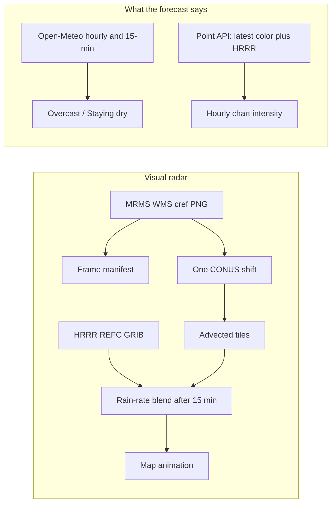
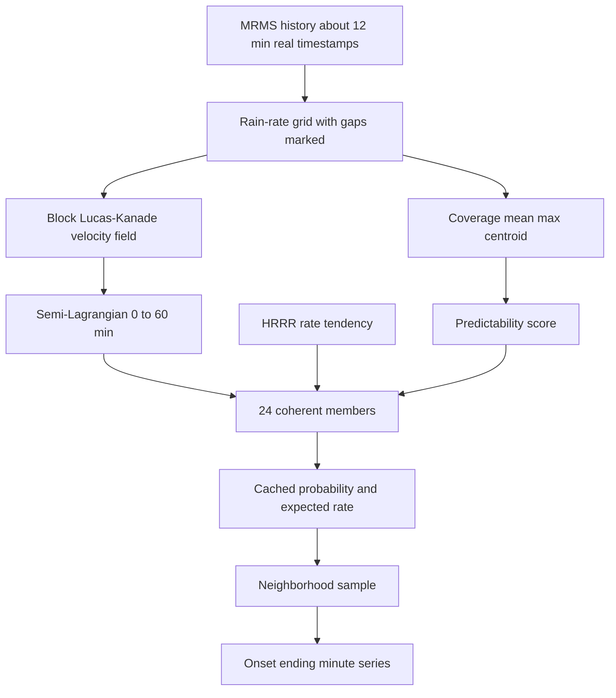

# Probabilistic precipitation nowcast

This is the design and phase contract. The visual radar pipeline stays as described in [radar.md](radar.md). Phases 1–3 are scoreboards only. Phase 4 adds an internal point API. None of them change forecast wording.

The visual MRMS/HRRR map stays as it is. The new system is a point forecast beside it. Phase 1 is the scoreboard for the predictors that exist today.

## Current pipeline

Two pipelines exist, and they do not meet.

**Observations.** [server/lib/mrms.ts](server/lib/mrms.ts) reads NOAA WMS layer `conus_cref_qcd`, the styled QC composite reflectivity (`MergedReflectivityQCComposite`). Cadence is about 2 minutes. The time dimension keeps roughly 2 hours. There is no Surface Precipitation Rate product. Rain rate is Marshall-Palmer applied after the fact (`Z = 200 R^1.6`) in [server/lib/reflectivity.ts](server/lib/reflectivity.ts).

The map asks for the last 60 minutes at a 5-minute slot in [server/api/v2/radar/frames.ts](server/api/v2/radar/frames.ts). The device loads observed tiles straight from NOAA. The server only lists times.

**Motion.** [server/lib/nowcast.ts](server/lib/nowcast.ts) downloads two CONUS PNGs at 640×320 (~10 km per pixel), builds a binary wet mask (`alpha > 40`), and brute-forces one integer shift over ±16 pixels by mask overlap. Lookback is 40 minutes (`MOTION_LOOKBACK_MIN`). That single `(u, v)` is applied everywhere. The overlap score is thrown away. If the pair is under 4 minutes apart, motion is reported as zero. Intermediate frames are not used.

**Extrapolation.** Future frames are the newest PNG translated by `u * lead` and `v * lead`, every 5 minutes, out to 45 minutes ([server/lib/radar/providers/advection.ts](server/lib/radar/providers/advection.ts)). Sampling is backward and bilinear, but on dBZ, in `nowcastDbzAt`. It is one global translation, not a velocity field. Nothing grows or decays. The in-memory source cache holds 3 CONUS images (1600×800).

**HRRR.** [server/lib/hrrr.ts](server/lib/hrrr.ts) range-fetches composite reflectivity `REFC` from the NOAA GRIB bucket, 15-minute steps, ~3 km grid. [server/lib/render.ts](server/lib/render.ts) samples the nearest cell, not bilinearly. Between steps, tiles blend those two dBZ grids linearly. [server/lib/gridCache.ts](server/lib/gridCache.ts) keeps 6 decoded grids (~15 MB, ~130 ms each).

**Blend.** [server/lib/radar/transition.ts](server/lib/radar/transition.ts): pure advection through +15 min, rain-rate mix from +15 to +45, pure HRRR after that. If one side is missing, the other is used at full strength. Early HRRR weight was measured and rejected because it invents cells the radar does not see ([docs/radar.md](docs/radar.md)).

**Point API, which is not the nowcast.** [server/api/radar/point.ts](server/api/radar/point.ts) samples the past 60 minutes of WMS color at one pixel (10-minute cadence) and future HRRR at the nearest cell. It does not advect. A failed color read becomes `dbz: null`, which the app turns into intensity 0. CDN cache is 120 seconds. The app polls it every 75 seconds from [lib/useRadarAtPoint.ts](lib/useRadarAtPoint.ts).

**Words.** [lib/nowcast.ts](lib/nowcast.ts) (`nowcastSummary`, `rainStartsInMinutes`, `rainStopsInMinutes`) and [lib/rainOutlook.ts](lib/rainOutlook.ts) read Open-Meteo only. This morning at 30345, Open-Meteo was weather code 3 and 0 mm while MRMS at the same point was 50 dBZ. The map showed the cell. The hero said overcast and staying dry. Radar is only allowed to cancel rain animation, not to start it ([app/(tabs)/index.tsx](app/(tabs)/index.tsx)).

**Refresh.** [lib/refreshWeatherCaches.ts](lib/refreshWeatherCaches.ts) coalesces forecast, alerts, SPC, and tropical fetches. It does not refresh radar or a nowcast. Radar caches are the in-process PNG and GRIB maps plus short CDN headers.

## What to reuse

- Marshall-Palmer conversion in [server/lib/reflectivity.ts](server/lib/reflectivity.ts). Do not add a second Z-R.
- The backward-sampling geometry in `nowcastDbzAt`. The new sampler should interpolate rain rate, not dBZ. Leave the tile renderer alone.
- `observedTimes` / `selectObserved` for frame discovery. The nowcaster should keep real timestamps instead of the 5-minute display slots.
- HRRR `forecastFrames` and `gridForFrame` as an evolution hint, not as the position field.
- Rain bands in [lib/precip.ts](lib/precip.ts): drizzle above 0.02 mm/hr, light 0.6, moderate 2.5, heavy 7.5, storm 25. Those become very light, light, moderate, heavy, very heavy. One definition, mirrored on the server the same way reflectivity already is. The server deploy cannot import app modules.
- Provider seams in [server/lib/radar/types.ts](server/lib/radar/types.ts). The map does not need a new provider. pySTEPS is already noted in [docs/radar.md](docs/radar.md) and should stay out: it is Python, and this service is Node on Vercel with `pngjs`, `proj4`, and `gribberish` only.

## Shortcomings of the current predictor

- One velocity for the whole country. Cells moving different directions are averaged into one shift, or into zero when the shift is under a pixel.
- Motion uses two binary masks about 40 minutes apart. A cell that formed in the last 10 minutes contributes nothing. The score is not a confidence.
- Extrapolation cannot grow, decay, or initiate. Structure is frozen.
- The forecast sentence never reads radar or the advection field.
- The point sample is one pixel of styled color. A 2 km miss flips the forecast. Transparent pixels mix “no rain” and “no coverage.” A failed fetch becomes zero in the app.
- HRRR is reflectivity, 15 minutes apart, nearest cell, and often empty in the first minutes of a new run. It is blended as a second position field, which is the wrong job inside 20 minutes.
- There is no ensemble, no onset distribution, and no stored prediction to score later. “Better” can only be judged by looking at the animation.

## Proposed architecture

A new module, `server/lib/precipNowcast/`, produces a regional field once and samples it many times. The map keeps calling `nowcastFrames`.

**Field source.** Add an `ObservationField` interface: rain rate per cell, plus an explicit missing mask. The interface stays source-independent. Version 1 may fill it from a regional WMS GetMap (on the order of 400 km, about 1–2 km per pixel), inverted through the existing palette. Seven full CONUS precip-rate GRIB grids do not fit a serverless function (on the order of 100 MB decoded each). Palette inversion is integer dBZ, and inside the image a transparent pixel still means “nothing drawn,” not a proven coverage mask. Whether native MRMS Surface Precipitation Rate can replace styled-reflectivity, palette inversion, dBZ, and Marshall-Palmer is a separate investigation. It does not block Phase 1 and it does not change the radar source the map uses. The result of that investigation is recorded in the design contract. Verification still has to say whether the palette floor matters.

Native MRMS Surface Precipitation Rate was checked on 4 Oct 2026 and is not wired in. `s3://noaa-mrms-pds/CONUS/PrecipRate_00.00/` publishes a gzipped GRIB2 about every 2 minutes. The 12:00 UTC file was 858 KB compressed and a 7000 by 3500 grid (0.01 degree). Packed data is under 1 MB, so bandwidth is fine, but decoding yields about 24.5 million values. A nowcaster must crop to a region before keeping several frames. `gribberish` can read GRIB2; the file is gzipped, so it is not a byte-range fetch like HRRR `REFC`. Phase 1 still verifies against the styled composite the app already uses.

**History.** Use the live ~2-minute cadence, targeting about seven frames over ~12 minutes. Missing slots stay missing. Do not write zero into a gap, and do not run motion across a gap wider than a configured maximum.

**Motion.** Block pyramidal Lucas-Kanade on rain rate, in TypeScript, no new dependency. Blocks on the order of 16–32 pixels so different parts of the field can move differently. Timestamps set `dt`; do not assume a fixed interval. Each block keeps a residual so low-quality vectors can be dropped. This replaces the global shift only inside the new module. A velocity field is not accepted because it looks smooth. Phase 2 must recover known ground truth on synthetic fields: one translation, two regions moving different directions, stationary precipitation, translation with simultaneous growth or decay, missing or irregular frames, and low-intensity noise.

**Extrapolation.** Backward trace along the velocity field, bilinear in rain rate. Do not lock the internal step to one minute before measuring it. Phase 2 benchmarks lead steps of 1, 2, and 5 minutes and keeps the cheapest step that does not materially change onset and ending error. The public point API can still return minute values by interpolation. Integer-pixel copies are not used.

**Ensemble.** Default 24 members, configurable. Each member gets a coherent perturbation: one speed factor, one direction offset, a smooth local-velocity residual, one intensity scale, one growth bias. Same seed for a given observation time so a replay is stable. Do not add independent noise per pixel. Store per lead a probability and an expected rate, not 24 dense grids.

**Evolution.** Connected components above the meaningful-rain threshold, regional only: area change, mean and max rate, centroid drift, how stable the motion field is, divergence. That separates steady approach, approach-and-die, and growth upstream. No full cell tracker.

**HRRR.** Convert neighborhood REFC to rain rate with the same Z-R. Use the change in that rate as a growth/decay multiplier on the extrapolated radar field. From 0–20 minutes the multiplier stays near 1 unless radar confidence is poor. HRRR does not move the echo. Initiation is a probability lift when radar is dry, confidence is low, and HRRR develops rain. It is not a painted cell at +5 minutes.

**Confidence.** One score from motion residual, frame completeness, age of the newest frame, intensity persistence, and growth rate. High confidence keeps radar in charge longer. Low confidence widens member spread and lets the HRRR tendency in sooner. All of those knobs live in one config module.

**Neighborhood.** Sample a Gaussian around the point. Start at 5 km. Native MRMS is about 1 km, the regional image is about 1–2 km, and a 20% speed error on a 40 km/h cell is about 4 km at 30 minutes. Closer cells weigh more. Radius is config.

**Point model.** New endpoint, old `/api/radar/point` unchanged:

- `generatedAt`, `observationTime`, `confidence`
- `minutes[]`: offset, probability, expected mm/hr, band, precip type
- `onset` and `ending`: probability, p10, p50, p90 minutes
- horizon probabilities at 10, 20, 30, 45, 60 minutes
- `diagnostics` for age, frames used, motion quality, ensemble spread, HRRR weight

Ending requires the neighborhood to stay under the meaningful-rain threshold for 8 minutes before that member counts as ended. One dry minute does not end the rain. An exact minute is returned only when p10 and p90 are close enough; otherwise the API still returns the distribution and the copy should say “about.”

**Cache.** Key a regional field by a coarse tile id and observation time. Same pattern as `gridCache`: a few warm regions per instance. Point responses can use a short CDN cache. Do not compute an ensemble per coordinate.

**Rough cost, per region, every 2–5 minutes.** About 7 WMS images of ~512² (~7 MB). Block LK is a few million operations, well under a second. Extrapolation of ~12 stored leads is the heavy step, on the order of 1–3 seconds if done once per region. Twenty-four members must share the base trajectory and apply low-dimensional perturbations while reducing to probability and mean rate, or the function will not fit. A full CONUS dense ensemble will not be built.

## Files

Add, and do not retarget the map through them:

- `server/lib/precipNowcast/config.ts`
- `server/lib/precipNowcast/field.ts`
- `server/lib/precipNowcast/motion.ts`
- `server/lib/precipNowcast/extrapolate.ts`
- `server/lib/precipNowcast/evolution.ts`
- `server/lib/precipNowcast/ensemble.ts`
- `server/lib/precipNowcast/hrrr.ts`
- `server/lib/precipNowcast/sample.ts`
- `server/lib/precipNowcast/predict.ts`
- `server/lib/precipNowcast/verify.ts`
- `server/api/v2/nowcast/point.ts`
- `server/scripts/nowcast-bench.ts` and `server/scripts/nowcast-verify.ts`

Leave [server/lib/nowcast.ts](server/lib/nowcast.ts), the tile route, the frame manifest, and [server/api/radar/point.ts](server/api/radar/point.ts) behaving as they do now.

Bands: extend the existing names in [lib/precip.ts](lib/precip.ts) only by aliasing very light = drizzle and very heavy = storm. Mirror the numbers in the server config and pin them with a test. Do not add new mm/hr floors.

Client wording (`Rain likely in about 20 minutes`) is a later flagged read of the new endpoint. It does not replace Open-Meteo copy until verification says the new predictor is better. That wiring is out of the first algorithm phases.

## Validation

There is no durable disk on the serverless function. Phase 1 scores live or scripted replays to local JSONL. A Blob sink can come after the record format is stable.

Each saved prediction stores time, predictor version, coordinate, confidence, minute probabilities, expected rates, and onset/ending percentiles. A later run scores it against the MRMS field at +10, +20, +30, +45, and +60.

Metrics, by lead: rain/no-rain hit rate, false alarm, miss, Brier score, onset and ending error, rain-rate error. Regime tag from the evolution step: widespread versus convective (coverage versus peak rate). Predictors run side by side: persistence, today’s global advection sampled at the point, HRRR-only, and the new ensemble. No accuracy claim without that table.

`predictor=baseline|ensemble` on the new endpoint. Default remains the current behavior everywhere the app reads today.

## Constraints added before Phase 2

- The visual radar pipeline stays untouched. Phase 1 adds a side scoreboard only.
- Open-Meteo remains the production source for user-facing forecast wording until verification shows the new nowcaster is better.
- Lucas-Kanade is not accepted on appearance. Phase 2 includes the synthetic motion tests listed above.
- `ObservationField` stays source-independent. Native MRMS Surface Precipitation Rate is investigated and documented, not adopted in Phase 1.
- Internal lead spacing is chosen by a 1-, 2-, and 5-minute benchmark in Phase 2. The point API may still interpolate to minutes.

## Phase 1 contract

Score persistence, global MRMS advection at the point, HRRR-only, and Open-Meteo (only when a past run can actually be retrieved) on the same coordinates and the same issue time. Rain/no-rain uses `DRY_MM_HR` from `lib/precip.ts` (0.02 mm/hr). Do not introduce a tighter threshold to flatter the current predictors.

Records are schema version 1 JSONL on local disk. There is no production store. Leads are +10, +20, +30, +45, and +60 minutes. Metrics stay split by lead: hits, false alarms, misses, Brier score where a probability was stored, rain-rate error, onset error, ending error, and sample count. A null rate is missing data, not dry weather.

The fixed case list is the replay set: desert dry, Pacific widespread, Atlanta 30345 convective, plains convective, Midwest isolated, Gulf widespread. The intended regime is a label on the case, not something rewritten after seeing the score.

## Phases

1. **Baseline.** Score the four current predictors and record schema version 1. No new forecast, no wording change, no map change.
2. **Deterministic motion.** Multi-frame regional field, block Lucas-Kanade with synthetic ground truth, semi-Lagrangian extrapolation, and a measured choice among 1-, 2-, and 5-minute internal steps. Compare to phase 1 on the same cases.
3. **Ensemble.** Coherent 24-member probabilities from that motion field. Still no HRRR tendency.
4. **Point API.** Neighborhood sample, onset and ending distributions, diagnostics. Feature-flagged endpoint only.
5. **HRRR tendency and confidence.** Growth/decay and earlier HRRR influence only when radar confidence is low.
6. **Calibration.** Fit the config from accumulated scores. Do not tune by eye.

Each phase has its own script and can be rejected without shipping the next one.

## Phase 1 records

Schema version is `1`. A reader must reject any other `schemaVersion`. Rows are JSONL. `server/.nowcast-out/` is local output and is not a production store.

`recordType: "prediction"` carries `predictorId` (`persistence`, `mrms-advection`, `hrrr`, `open-meteo`), `predictorVersion`, shared `issuedAt`, `caseId`, `intendedRegime`, `rainThresholdMmHr` (0.02), `analysis.rainRateMmHr` (null if that predictor had no analysis), and five `leads` at 10, 20, 30, 45, and 60 minutes. Each lead has `precipProbability` (0–1 or null) and `expectedRainRateMmHr` (null means missing, not dry). `onset` and `ending` are `{ applicable, minutes }`. Scoring recomputes them from the rates.

`recordType: "observation"` is MRMS `conus_cref_qcd` at the same `caseId` and `issuedAt`. `leadMinutes: 0` is the analysis frame. Truth rate is null only when the sample failed.

`recordType: "scorecard"` splits hits, false alarms, misses, correct rejections, Brier score, rain-rate MAE, and sample count by lead. Onset and ending report matched count, MAE in minutes, and unmatched counts. A pair is timed only when both series can answer the question.

The fixed cases live in `server/lib/precipNowcast/cases.ts`. Phase 1 code is the `server/lib/precipNowcast/` scoreboard plus `server/scripts/nowcast-score.test.ts` and `server/scripts/nowcast-baseline.ts`. The file list earlier in this document is the later nowcaster, not this phase.

## Phase 2 records

`predictorId: "regional-motion"` version `regional-motion-1` is added beside `mrms-advection`. Schema version stays 1. The same observations and the same five leads are scored. Brier is stored as a deterministic 0/1 and is not the objective.

The field is a 3° equirectangular region, 160×160, filled from the styled `conus_cref_qcd` composite through the existing palette and Marshall-Palmer conversion. Transparent pixels are empty. Off-palette and failed samples are missing. Neither is stored as 0 mm/hr. History is up to 8 real frames from the previous 15 minutes. A failed frame is skipped. Pairs closer than 30 seconds or farther than 300 seconds are rejected.

Motion is block pyramidal Lucas-Kanade on rain rate, 16-pixel blocks, mean-normalised so a uniform brightening is not motion. A block needs support, a minimum structure-tensor eigenvalue, and a residual under 0.55 to count as solved. Unknown blocks take an inverse-distance fill from the better-textured solved vectors within 72 pixels, then the median of those vectors. A measured stationary echo stays a solved zero. An empty sample with no velocity stays empty, because every displacement of empty is empty. Echo with no velocity stays missing. Extrapolation is a backward trace of rain rate, bilinear, with no growth or decay.

Internal lead step is 2 minutes. On a synthetic moving cell the rule was: rain-rate MAE within 0.5 mm/hr of a 1-minute trace, and core arrival shifted by at most 2 minutes. Five minutes missed that rule (MAE 1.45 mm/hr, onset shift 1 minute). Two minutes passed (MAE 0.41 mm/hr, onset shift 0). A full 96×96 trace at 30 minutes took 22 ms at a 1-minute step, 7 ms at 2 minutes, and 4 ms at 5 minutes, so the choice is the rate error, not the CPU time.

`npm run nowcast:baseline -- --expand` scores six extra cities into `server/.nowcast-out/expanded` and does not mix them into the six-case table. `--issue` replays one time. `--append` adds to the local JSONL. Labels are not rewritten after a run.

## Phase 3 records

`predictorId: "regional-ensemble"` version `regional-ensemble-1` sits beside `regional-motion`. Schema version stays 1. The stored probability is the fraction of members above 0.02 mm/hr. The stored rate is the member mean. Light (0.6) and moderate (2.5) probabilities, spread, and the 10th and 90th percentiles are diagnostic strings in lead order. They are candidates from the existing rain bands, not a new scoreboard line.

Evolution is the residual after the Phase 2 velocity field aligns the older frame onto the newer one. A uniform translation leaves that residual near zero. Missing samples are skipped. A block tendency is clamped to 3 mm/hr per minute, then forgotten with a 12-minute half-life, and the forecast rate cannot exceed 75 mm/hr. Those limits were set before the Atlanta replay. Twenty-four members perturb that one analysis. They do not rerun optical flow. Speed, a cross-track component, the tendency, and the half-life are scaled together. The spread widens when few vectors are solved, pairs are rejected, or the tendency flips between frames. The Phase 2 block-quality number is not used as a probability.

On the 12:12 UTC Atlanta replay the aligned history supported about 0.08 mm/hr of growth per minute. The ensemble mean stayed near 1 mm/hr and its 90th percentile at +45 was 1.2 mm/hr. The observed 49 mm/hr was outside that distribution. The growth was not in the prior frames.

## Phase 4 records

Checkpoint: `c9c5fbc`.

`GET /api/v2/nowcast/point` is schema version 1, predictor version `regional-ensemble-1`. It does not replace `/api/radar/point`. Query: `lat`, `lon`, optional `radiusKm` (default 2), `threshold` (default 0.6 mm/hr, the light band), `endingDryMin` (default 8), and `issuedAt` for a replay. The response is not cached on the CDN. The regional ensemble is cached in the process.

`confidence` is one minus the Phase 3 uncertainty score. It is how predictable the analysis is. `minutes[].probability` is the share of members whose neighborhood rate meets a threshold. Those are different numbers.

Thresholds stay the Grey Sky bands: trace above 0.02 mm/hr, light at or above 0.6, moderate at or above 2.5, heavy at or above 7.5. Onset and ending use member probability at the selected threshold, not the ensemble mean. A member onsets only after two native steps (4 minutes) stay at or above the line. A member ends only after the configured dry spell, default 8 minutes. A missing rate does not count as dry. Percentiles are omitted when fewer than three members have a time. Odd minutes are a linear blend of the 2-minute steps, and blended probabilities are rounded to two decimals.

The neighborhood is a Gaussian around the coordinate. Sigma is half the radius. The center plus two rings of eight bearings are normalized to sum to one. Radius 0 is the exact cell. Member motion perturbations are unchanged. The default radius is 2 km because three wet points cannot justify a wider footprint, and 3–5 km started to treat nearby heavier rain as rain at the point.

The region key is the observation time, the predictor version, latitude rounded to 1°, and longitude rounded to 0.5°. Atlanta, Marietta, and downtown share one key on the 12:46 UTC issue. A half-degree latitude tile had put downtown in a different analysis.

## Phase 5A records

Checkpoint above is `c9c5fbc`. This phase does not change the point API, the map, or forecast wording. It does not put HRRR reflectivity into the ensemble, and it does not fit a score to Atlanta or Marietta.

Cases live in `server/.nowcast-cases`, schema version 1, one directory per region and observation time. `case.json` holds the region key, predictor version, history counts, the point forecast, the 24 member rates at the native 2-minute steps, verifying MRMS rates, and environmental samples. Each MRMS frame is `frames/N.bin` (`NCF1`, width, height, cell state, float32 rain rate). A region is about 0.9 MB of fields. `npm run nowcast:capture -- --issue <ISO>` writes it. `npm run nowcast:replay -- --id <point> --predictor regional-ensemble-1|regional-motion-1` reruns that predictor on the saved fields after the MRMS archive has moved on. `npm run nowcast:calibrate` scores whatever has been stored. Intended regime labels are copied from the case list and are not rewritten after verification.

The first stored hour is 2026-10-04T12:46:40Z, 14 points, 12 regions. The radar showed growing convection at Atlanta 30345 and Marietta, a trace at downtown, and dry weather at the other eleven points. No stratiform shield, line, decaying area, or stationary area was in this hour. The 12:12 UTC frames were already gone, so that earlier issue is not in the archive.

Environmental samples are the HRRR 11Z run, surface forecast hour 1, valid 12:00 UTC, which was published before 12:46. Sub-hourly reflectivity is the same run at 12:15 and 12:45. RAP has the same surface fields at 13 km and was not decoded. At Atlanta, Marietta, and downtown the air was unstable and moist (surface CAPE about 830–1030 J/kg, CIN 0, precipitable water about 50 mm, dewpoint about 22°C, lifted index about −3). HRRR reflectivity was −10 dBZ and the model rain rate was 0 at 12:00 and at 12:45, so the model did not show the burst before it happened. Miami was more unstable (CAPE 2300 J/kg, lifted index −5.8) and stayed dry. Ten-metre convergence did not pick out the points that grew. Hourly-max vertical velocity in the lowest kilometre was about 0. Updraft helicity was 0. Those fields do not separate “this point will grow” from “this point will not” inside one unstable airmass, so there is no convective-vulnerability score. The raw samples stay on the case.

Message sizes on that HRRR file, and the decode time when a field was fetched: surface CAPE 404 KB / 0.8 s, surface CIN 136 KB / 0.5 s, most-unstable CAPE 499 KB, precipitable water 972 KB, 2 m dewpoint 1.1 MB, lifted index 937 KB, precip rate 78 KB, hourly reflectivity 433 KB, categorical rain 65 KB, 1 km max vertical velocity 2.5 MB / 0.8 s, sub-hourly reflectivity about 0.5 MB, updraft helicity 37 KB. Ten-metre wind, fetched once for convergence, was 4.8 MB and 1.9 s for both components. Helicity and bulk shear are about 1.9–2.4 MB and were not fetched. One regional forecast can share a cached model hour across points. That is still several megabytes, which is too much to add to every nowcast until a field earns it.

Calibration on these 70 leads is marked too small: 14 points, one hour, and only the Atlanta and Marietta leads are meaningfully wet. Dry points sit inside a narrow distribution and make coverage and light-rain Brier look better than the bursts were. The bursts remain outside p90. Middle reliability bins are empty.

## Phase 5B records

Checkpoint above is `54d665d`. This phase does not change the point API, the 2 km neighborhood, the ensemble spread, or forecast wording. No weights were fitted. Trace coverage stays inside this diagnostic. It is not a user-facing rain probability.

`npm run nowcast:precursors` reads each stored case, reuses the Phase 2 motion field, and writes `precursors.json` beside `case.json`. The question is whether precipitation is beginning, organizing, or intensifying near the forecast trajectory. The environment samples from Phase 5A stay on the row as context.

A second hour was captured at 2026-10-04T14:00:42Z, same 14 points, with verification through +60. It is the same Atlanta complex later, not a new storm: Atlanta stayed light (about 2.4 mm/hr down to 1.0), Marietta fell from light rain to trace, downtown stayed dry except a trace at +30 and +60, and Miami stayed dry. Houston’s HRRR reflectivity was 28 dBZ while MRMS within 20 km was empty, and the point stayed dry. The other controls stayed dry. The archive still has no stratiform shield, organized line, isolated cell away from Atlanta, or stationary rain.

Initiation is a cell wetter than 0.02 mm/hr whose motion-aligned previous sample was dry. Existing-cell growth is a cell that was already wet and got heavier. A one-frame speck does not count: a cell must initiate on two pairs, and a component must cover three cells. The trajectory is the upstream corridor along the target’s motion vector, 8 km either side, out to 60 minutes. Speed under 1 m/s leaves the corridor unsupported. Circles of 10 and 20 km are computed either way. The target vector can be too slow for a corridor while the surrounding 20 km is fully solved, which is what happened at Atlanta.

On the 12:46 growth hour, Atlanta went to 36 mm/hr and Marietta to 65. Downtown, in the same unstable airmass, went dry. Miami, more unstable, stayed dry. Trace coverage within 20 km was 0.54, 0.78, and 0.45 at the three Atlanta points and 0.01 at Miami. That separates “echo is already around” from “unstable and empty.” It does not separate downtown from the points that grew. Downtown’s corridor initiation fraction was 0.13 and its nearest persistent initiation was 2.6 km. Atlanta’s corridor was unsupported and its nearest persistent initiation was 15.7 km. Marietta’s corridor was already full of rain and its initiation fraction was 0. The same coverage numbers were still high at 14:00, when nobody intensified. Local motion convergence was negative at both growing points and positive downtown. An elongated weak-echo flag fired only at Atlanta at 14:00, after the burst, while the point stayed light. The point residual had the same sign as the Phase 3 tendency and the same limit: it saw a little growth and missed the burst.

Feature time after motion was 11–41 ms. Motion itself was 0.2–1.4 s and is already paid by the ensemble. The script’s heap was 11–32 MB. No extra model or radar download.

Same-day MRMS objects on `noaa-mrms-pds`, HEAD only: precip rate 839 KB, QC composite 1.64 MB, Q composite 1.99 MB, lowest-altitude reflectivity 6.9 MB, 18 dBZ echo top 1.11 MB, VIL 571 KB, radar quality index 720 KB. Each is a full CONUS gzip, about 2 minutes, about 1 km, with no regional subset. A float grid is on the order of 100 MB before it can be clipped. Lowest-altitude reflectivity is the product that might show a boundary before the composite core, and it is also the expensive one. This probe does not show a multi-day archive. They were not decoded.

## Phase 5C records

Checkpoint above is `c46688b`. No weights were fitted. Ensemble spread, the 2 km neighborhood, the 0.6 mm/hr line, and production wording are unchanged.

The Phase 5B features stay in the replay. They are not initiation predictors. Trace and light coverage, the change in trace coverage, new-cell count, corridor initiation, distance to a persistent initiation region, existing-growth fraction, weak-echo persistence, elongated weak echo, and local motion convergence did not separate Atlanta and Marietta’s rapid growth from downtown’s drying, and they did not separate the 12:46 growth hour from the 14:00 weakening hour. The motion-compensated point residual remains the Phase 3 evolution signal.

A target vector slower than 1 m/s, or a vector that was only filled in from elsewhere, no longer defines a corridor. The direction then has to be the weighted median of at least three solved vectors inside 20 km, and at least half of their weight has to lie within 45° of that median. Those gates were set before the replay. On the synthetic tests a slow target inherits an agreed eastward neighborhood, a split neighborhood stays unsupported, and a fast filled vector with no solved neighbors stays unsupported. Replayed on the archive, Atlanta at 12:46 stayed unsupported. Every sampled vector inside 20 km was solved and the median speed was 1.2 m/s, but the median of the east and north components was 0.54 m/s, so the vectors do not share a direction. Downtown’s corridor was still the target’s own solved vector, its initiation fraction was still 0.13, and the point still went dry. Marietta’s corridor was still full of existing rain and its initiation fraction was still 0. The fallback closed a few corridors that had been drawn from filled vectors over empty ground, at Houston and Miami. It does not change the Phase 5B conclusion.

`npm run nowcast:structure` decodes native MRMS in a child process, writes a 300×300 clip, and exits so the full grid is released. One process that decoded two lowest-altitude frames kept about 130 MB of resident memory after garbage collection even though the JavaScript heap returned to 9 MB, so a history is not decoded in the parent. The grid is 3500×7000. gribberish returns it as a JavaScript array. Peak resident memory was about 0.9 GB for echo top and precip rate and about 1.1 GB for lowest-altitude reflectivity. Heap at the peak was 204–260 MB. Download plus decode was about 2 seconds for echo top and precip rate and about 3 seconds for lowest altitude. Eight frames are the recent 16 minutes. That cost is acceptable for a local script and too large for the 1024 MB nowcast function, which would be over its limit on one lowest-altitude frame before it did any other work.

Echo top 18 dBZ decoded. The unit string was empty; the values are 4–12, which is the product’s kilometre scale. In the 15 minutes before 12:46, Atlanta’s point rose from 6.5 km to 8.0 km and the 20 km maximum from 8 km to 10 km. Marietta’s neighborhood maximum stayed at 10 km, and a top appeared at the point at 7.5 km. Downtown’s point had no top. Before 14:00, with the same storm no longer intensifying, Atlanta’s point fell from 5.5 km to 4.6 km and Marietta’s from 6.9 km to 4.6 km, while the neighborhood maximum stayed near 10 km. The point trend differs between those two hours by about a kilometre. It is not a rise that leads the burst: the tops were already mid-level, and the neighborhood maximum was already 8–10 km in both hours. At 20:00 Marietta’s point had no echo top in the preceding 15 minutes, the neighborhood maximum was 11–12 km because Atlanta’s core was inside that circle, and Marietta then went from a trace to 11 mm/hr. A 20 km echo-top maximum does not say which point will grow.

VIL was not read. gribberish aborts the process on that grid (`range end index 24500001` against a slice of length 24500000). The abort is not catchable, so it was not retried inside the history job. No other GRIB tool is installed, and a second decoder was not added.

Lowest-altitude reflectivity is dBZ, and negative values down to about −28 are real. Before 12:46 Atlanta’s point stayed near 30 dBZ (30.5 then 29.7) and Marietta rose from 24.5 to 34.5. Before 14:00 both points fell (31 to 28, and 36 to 26). Before 20:00 Marietta’s point was only 9 dBZ and then the surface rate became heavy. The low-level field shows the storm that is already there. It does not show a column building at a still-dry point. Miami’s point was 20–30 dBZ in all three hours, with echo tops of about 2 km or none, while native precip rate and the styled composite were both 0 and the point stayed dry. Houston at 14:00 was 15–21 dBZ at lowest altitude, with precip rate 0 and no echo top, and stayed dry. `MergedReflectivityQComposite` remains a second composite, not this low-level scan. An elongated patch of 0–20 dBZ appeared at downtown at 14:00, while that point stayed dry, and at all three Atlanta points at 20:00, while rain was already there. That is not a boundary detector.

Radar quality index is valid GRIB2. gribberish rejects parameter `(8, 0)` and returns no values. The dry Miami, Houston, and Phoenix samples therefore cannot be split into “confidently dry” and “poor coverage” from this library. Native precip rate, which did decode, was 0 in those same places.

Native precip rate is mm/hr. At 12:46 the point values were Atlanta 3.0 against a styled 2.4, Marietta 4.9 against 7.5, and downtown 0 against a trace. Across the preceding window Atlanta’s native rate fell from 5.6 to 3.0, and the last motion-compensated step was flat, while the styled rate then jumped to 36. Marietta’s native rate rose from 0.3 to 4.9 over that window and was flat on the last step, then the styled rate reached 65. At 20:00 Marietta’s native rate stayed 0 at the point while the styled trace became 11 mm/hr an hour later. The heavy cores sit in the same part of the window on both products. The native rate does not move the evolution signal enough to be worth switching the predictor.

A third hour was captured at 2026-10-04T20:00:40Z, verified through +60. Atlanta was already 15 mm/hr and stayed moderate to heavy. Marietta went from a trace to 11 mm/hr. Downtown went from 2.4 mm/hr to 13 mm/hr and back to light. Miami stayed dry with CAPE still about 2300 J/kg. It is the same region later, not a new regime. The archive still has no stratiform shield or organized line.

There is currently no demonstrated local initiation signal strong enough to justify an initiation-probability model. Styled-composite coverage and initiation features did not discriminate where convection developed. CAPE, CIN, and precipitable water described a storm-supportive environment and did not localize initiation. Echo top added vertical structure and no demonstrated early initiation signal. Lowest-altitude reflectivity described existing storm structure and did not solve initiation. Native precip rate did not materially change the evolution signal. VIL remains untested because the current decoder aborts. Radar quality index remains untested because the current decoder does not support its parameter. No Phase 5D initiation model follows from this.

## Phase 6 records

Checkpoint above is `3810b78`. Phase 5A remains `54d665d`. Phase 5B remains `c46688b`. The predictor stays `regional-ensemble-1`: the 2 km neighborhood, the 0.6 mm/hr meaningful-rain line, the 8 minute ending, the existing evolution limits, and 24 members. This phase does not add an initiation heuristic, fitted precursor weights, an HRRR reflectivity blend, a wider ensemble, a random initiation member, a new evolution cap, or another MRMS product. Production wording is unchanged. The app does not read the shadow decision.

`npm run nowcast:collect` is a research loop, not a user request. It scouts the benchmark and expanded cities with one GetFeatureInfo each and groups them on the same 1° by 0.5° snap as the point product. The whole region is archived, so Atlanta, Marietta, and downtown stay one case. A region is kept for an onset (a point crossing 0.6 mm/hr, or leaving a dry pixel for a trace), an ending (a point falling back through 0.6), growth or weakening of at least 1 mm/hr while wet, a boundary (meaningful rain beside a point below 0.6), or any wet point. Onset and ending ignore the 20 minute gap. Everything else waits 20 minutes. A region that is dry at every scouted point is kept at most once per 6 hours. A failed sample is not stored as dry. The bundle is the same replay store as Phase 5, so the forecast can be rebuilt after MRMS rolls off. A fresh collector state reads that archive and does not treat an existing dry control as a new one.

One cycle at 2026-10-04T21:50:39Z kept the Atlanta region because Marietta had gone from 0.42 mm/hr at 20:00 to 13.3. The other eleven regions were dry and inside the 6 hour gap. The new bundle has 8 frames. Its future leads are still empty, so it is not in the scores below. At issue time all three points were already raining. It is the same complex, not a new regime.

An event is the snapped region plus the UTC hour. Points in one bundle share that id. Adjacent hours of one storm are still one storm, so the report also counts region-days. The scored archive is 42 points, 210 point-leads, 36 region-hours, and 12 region-days. Three of those region-hours are wet, and they are one region-day: the Atlanta convective complex on 2026-10-04. The other cities are dry controls. There is still no stratiform shield, organized line, isolated cell away from that complex, or stationary rain.

Scores use the stored point product. They do not refit it. A yes at a lead is probability at or above 0.5, the existing scoring convention, not a wording cutoff. Observed onset is the first stored lead at or above 0.6 mm/hr when the analysis was below it. Those leads are 10, 20, 30, 45, and 60 minutes, coarser than the forecast’s 4 minute onset rule. Observed ending, for a point already at or above 0.6, is the first of two consecutive verifying leads below 0.6. That is the 8 minute rule at the stored spacing. A single dry lead at the end of the series is not an ending.

Continuous error on all point-leads is small because most points are dry and the median absolute error is 0. Wet leads are not. Mean absolute error is 1.20, 1.40, 2.11, 0.45, and 0.62 mm/hr at +10 through +60, with a wet count of 7, 6, 6, 6, and 6. Bias is negative through +30 (the forecast too low) and +0.56 at +60. CRPS is 1.16, 1.32, 1.99, unavailable at +45 because that lead is not a native 2 minute step, and 0.50 at +60. p10–p90 coverage of every point-lead is 0.76, 0.79, 0.76, 0.83, and 0.86. p25–p75 coverage is 0.76, 0.76, 0.76, 0.79, and 0.83. On the wet leads alone, p10–p90 coverage is 0.00, 0.00, 0.00, 0.33, and 0.50. Pooled, wet coverage is 0.16. The wider half of those wet leads had mean absolute error 10.1 mm/hr and the narrower half 5.2, so a larger spread did go with a larger error, and the spread is still too small to cover the growth. Spread was not changed.

Trace Brier is 0.05 (reliability 0.01, resolution 0.11, 210 leads, 36 events): hit 0.95, miss 0.05, false alarm 0.05, correct rejection 0.95. Light, at 0.6 mm/hr, is Brier 0.02 (reliability 0.00, resolution 0.10): hit 0.97, miss 0.03, false alarm 0.02, correct rejection 0.98, from 30 hits, 1 miss, 4 false alarms, and 175 correct rejections. Moderate is Brier 0.04, hit 0.67, miss 0.33, false alarm 0.04. Heavy is Brier 0.04, hit 0.57, miss 0.43, false alarm 0.01. A reliability bin is readable only with at least 8 point-leads and 5 events. For light rain the only readable bin is 0.0–0.2 (176 leads, 36 events, forecast 0.00, observed 0.01). The 0.8–1.0 bin has 31 leads from 3 events and is suppressed (forecast 1.00, observed 0.87). The low Brier is the dry majority. This archive does not calibrate the system.

One onset is scored: Marietta at 20:00, analysis 0.42 mm/hr, first wet verifying lead at +10. The onset p50 was 16 minutes, so the timing error is 6 minutes late. There is no early case. No onset was missed and none was false, on that one event. Six points were already raining and are not onsets. One ending is scored: Marietta at 14:00, below 0.6 from +20 onward. The shadow state was still “rain continuing,” so the ending was missed. No ending time was issued, so there is no timing error. No false ending was issued.

The shadow rule is `shadow-1`. It reads meaningful-rain probability over 60 minutes, the already-raining probability, the onset and ending p10–p90 widths, and confidence. It does not read expected rain rate. A missing width is treated as broad. Experimental cutoffs, not fitted: possible 0.4, likely 0.7, already raining 0.5, ending possible 0.4, ending likely 0.7, narrow 15 minutes, broad 30 minutes, imminent only if the onset p50 is within 20 minutes, low confidence 0.4. Already raining becomes ending-likely only when the ending probability is high, the ending window is narrow, and confidence is not low; otherwise ending-possible, otherwise raining. Not already raining and likely becomes timing-uncertain when confidence is low or the onset window is broader than 30 minutes, imminent when the window is within 15 minutes and the p50 is within 20, and otherwise rain-likely. Between 0.4 and 0.7 is rain-possible. Below 0.4 is dry. A high probability with a wide onset does not become a specific minute. The phrases are diagnostics. `GET /api/v2/nowcast/shadow` returns the point product plus that decision and is not used by the app.

On the stored hours the shadow phrases were: Atlanta and Marietta at 12:46, “rain continuing,” and both were already raining before the burst to 36 and 65 mm/hr; downtown at 12:46, “staying dry,” and it did stay dry after a 0.1 mm/hr trace; Atlanta at 14:00, “rain continuing,” and it stayed light; Marietta at 14:00, “rain continuing,” while the rain had ended by +20; downtown at 14:00, “staying dry,” and it stayed at or below a trace; Marietta at 20:00, “rain likely in about 16 minutes,” and rain was there at the +10 lead; downtown and Atlanta at 20:00, “rain continuing,” and both were already raining; Miami and Phoenix at 12:46, “staying dry,” and both stayed dry. Confidence on the Atlanta growth hour was 0.35, which is under the low-confidence line, but those points were already raining so the state did not become a timing claim.

Candidate cutoffs from 0.3 to 0.8 each have precision 1.0 and recall 1.0 on 7 forecasts from 3 events. Those forecasts are the points that were already in rain or the one onset. None has the 20 forecasts and 10 events required below. No cutoff is selected.

The production gates were written before this score. They are not adjusted to it. All of them fail. The nowcast needs 30 wet region-hours and has 3. It needs 20 onset events and has 1. It needs 20 ending events and has 1. It needs 3 readable light-rain reliability bins besides the dry bin and has 0. Wet p10–p90 coverage needs to be at least 0.70 and is 0.16. A “likely” statement needs a false-alarm rate of at most 0.35 on at least 20 forecasts from 10 events; the rate on the 7 forecasts is 0.00 and the sample is too small. Onset timing MAE needs to be at most 15 minutes on at least 20 events; the one event is 6 minutes and does not meet the count. Still required: stratiform rain, an organized line, an isolated cell outside this Atlanta complex, stationary or slow rain, and enough clean onsets and endings that those gates can be evaluated. Calibration is not claimed.

